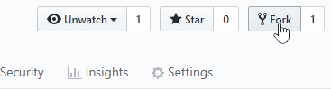
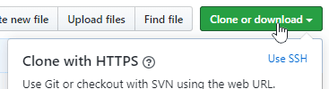
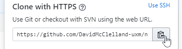

# nidirect-prototypeForm
**version 1.4.1**

[**GOV.UK Frontend version 3.11.0**](https://github.com/alphagov/govuk-frontend)

[**nidirect frontend version 2.0.0**](https://github.com/dof-dss/nidirect-frontend)

This is a JavaScript based prototyping kit for [nidirect]( https://www.nidirect.gov.uk/) applications. The aim of the kit is to allow designers, with minimal coding skills, to create interactive prototypes for usability testing.

## Limitations
Do not use the prototype kit for production. Prototypes made with the kit do not have the same security or accessibility provisions as a real application. You should only use the kit to create prototypes for user research and usability testing.

## Security
If you publish your prototypes online, you must protect them with a username and password. This is to stop members of the public finding prototypes and thinking they are real applications.
You must protect user privacy at all times, even when using prototypes. Always make sure you are handling user data appropriately. 


## Installation
If you haven't yet, you should first [set up Git]( https://help.github.com/en/github/getting-started-with-github/set-up-git). Don't forget to [set up authentication to GitHub from Git]( https://help.github.com/en/articles/set-up-git#next-steps-authenticating-with-github-from-git) as well.

### Step 1: fork the nidirect-prototypeForm repository
1.	On [GitHub]( https://github.com/), navigate to the [nidirect-prototypeForm]( https://github.com/DavidMcClelland-ux/nidirect-prototypeForm) repository

2.	In the top-right corner of the page, click **Fork**.

    

### Step 2: create a clone URL of your fork
1.	In your GitHub account, navigate to **your fork** of the nidirect-prototypeForm repository. 
2.	Under the repository name, click **Clone or download**.

    
3.	Using the **Clone with HTTPS** option, copy the web URL

    
    
### Step 3: download the clone to your computer via command line
1.	Open Terminal (macOS) or Command prompt (Windows)
2.	Type `cd` followed by the path of the folder, on your computer, you want to clone the repository to.
    
    For example `cd document/repos`    
3.	Type `git clone`, and then paste the URL you copied in **step 2**.

    It will look like this, with your GitHub username instead of `YOUR-USERNAME`:
    
    ```git clone https://github.com/YOUR-USERNAME/nidirect-prototypeForm.git```
4.	Press **Enter**. Your local clone will be created.


Now, you have a copy of the **nidirect-prototypeForm** repository on your computer.

## Using the protoype kit

Use the [nidirect-prototypeForm: user guide](./userGuide.md) for instructions on how to build your first prototype.

## Issues and suggestions
If you’ve found a bug in the prototype kit or have a suggestion you can:
* [create a GitHub issue](https://github.com/DavidMcClelland-ux/nidirect-prototypeForm/issues)