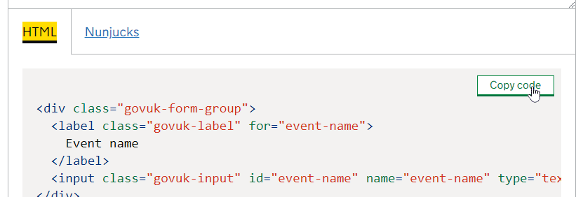

# nidirect-prototypeForm: user guide

Once you have a copy of the **nidirect-prototypeForm** repository on your computer you can start building your prototype in a HTML editor.

## How does it work?
The prototype kit uses JavaScript and the browser’s Session Storage to save and retrieve values entered by the user.

The kit consists of three HTML template pages to build your prototype with:

### formPage-1.html
The *form page* is used to display the [GOV.UK design system - components](https://design-system.service.GOV.UK/components/) that make up your prototype application.

Each *form page* collects, validates, and saves the entered values into the browser’s Session Storage. 
### checkPage.html
The *check page* uses the [GOV.UK Design System - check answers pattern](https://design-system.service.GOV.UK/patterns/check-answers/) to let the user check and change their answers saved in the Session Storage. 

You can have only one *check page* per application in this version of the prototype kit.
### endPage.html
The *end page* is used to let the user know they’ve completed the application successfully.
 

## Building your prototype

### Step 1: know what you’re building
Before you start building, sketch out your design for your prototype.

Sketches allow you to explore design ideas much faster and at lower risk than using the prototype kit right away.


### Step 2: build your form pages
*Form pages* are used to ask the user questions and collect their answers.

You can have as many *form pages* as you need for your application. 

1.	In your copy of the **nidirect-prototypeForm** on your computer, open the document `formPage-1.html` in a HTML editor.

2.	Go to [GOV.UK design system - components](https://design-system.service.GOV.UK/components/) and copy the HTML of the components you want to use in your prototype.

    

3.	Paste the HTML of the component into the document `formPage-1.html` below the `<h1>` heading.

4.	If the component is used to enter data, add a [GOV.UK design system - error message]( https://design-system.service.GOV.UK/components/error-message/) after the label and hint text of the component.

    ```
    <div class="govuk-form-group">
        <label class="govuk-label govuk-label--m" for="firstname">
            Firstname
        </label>
    
    |   <span id="firstname-error" class="govuk-error-message">
    |       <span class="govuk-visually-hidden">Error:</span> Enter your first name
    |   </span>
    
        <input class="govuk-input " id="firstname" name="firstname" type="text">
    </div>
    ```

    The error message should describe what to do when the user hasn't answered the question.

    The prototype kit will only show your error message if, when the **save and continue** button is pressed, the question hasn’t been answered.


5.	Make sure each input and error component has a unique `id`.

    The `id` will be used to identify and save the entered value into the browser’s Session Storage.
    ```
    <input class="govuk-input " id="firstname" name="firstname" type="text">
    ```
6.	To make a component optional, add the text `--opt` to the end of the component’s `id`.

    If the component is marked as **optional** it will save any value entered. But it will not show its error message if the question hasn’t been answered.

    ```
    <input class="govuk-input " id="firstname--opt" name="firstname" type="text">
    ```
    Remember to update the `for` attribute in the component label to match the new `id` and add the text **(optional)** to the label.

    ```
    <label class="govuk-label govuk-label--m" for="firstname--opt">
        Firstname (optional)
    </label>
    ```

7.	In the **save and continue** button component, at the bottom of the page, enter the next page of your prototype into the **saveData** JavaScript function.

    In the example below, the next page will be `'checkPage.html'`
    ```
    <button class="govuk-button" onclick="saveData('checkPage.html')">
        Save and continue
    </button>
    ```


### Step 3: build your check page
The *check page* lets the user check and change their answers saved in the Session Storage. 

The *check page* uses the [GOV.UK design system - summary list with actions component]( https://design-system.service.GOV.UK/components/summary-list/#summary-list-with-actions) to display the values saved in the Session Storage.

1.	Use a separate summary list for each group of related answers *(e.g. title, first name, and surname)*. And use a `<h2>` heading tag to give each group a name. 

2.	Each row of the summary list should display:
* the question (the component’s label)
* the user’s answer
* a link to change their answer

3.	Between the `<dt>` tags with the `class="govuk-summary-list__key"` enter the question (the component’s label).
    ```
    <dt class="govuk-summary-list__key">
        First name
    </dt>
    ```
4.	Between the `<dd>` tags with the `class="govuk-summary-list__value ` insert a `<span>` tag with the same `id` as the input component.

    This will display the value saved in the browser’s Session Storage.
    ```
    <dd class="govuk-summary-list__value">
        <span id="firstname"></span>
    </dd>
    ```

    To insert a line break after the value, add the attribute `name="newline"` to the `<span>`.

    ```
    <dd class="govuk-summary-list__value">
        <span id="address-street1" name="newline" ></span>
        <span id="address-street2" name="newline" ></span>
        <span id="address-city" name="newline" ></span>
        <span id="address-postcode"></span>
    </dd>
    ```


5.	Between the `<dd>` tags with the `class="govuk-summary-list__actions"` insert the link address to the input component’s *form page*.
    
    Make sure to add the component’s label between the `<span>` tags with the ` class="govuk-visually-hidden"`.

    This will help users using assistive technologies to understand the purpose of the link.

    ```
    <dd class="govuk-summary-list__actions">
        <a class="govuk-link" href="formPage-1.html">
            Change<span class="govuk-visually-hidden"> first name</span>
        </a>
    </dd>
    ```
    

### Step 4: build your end page
The *end page* is used to let the user know they’ve completed the application successfully.

The *end page* contains a **clear session** link in the footer. 

In usability testing, use this link to clear the user data saved in the Session Storage and return to the first page of your prototype application - `formPage-1.html` for the next participant.

As the nidirect *end page* design is different from the [GOV.UK design system - end page](https://design-system.service.GOV.UK/patterns/confirmation-pages/), use the guidance on the [nidirect user experience model (UXM)](http://uxm.nidirect.GOV.UK/writing-guide.html#transaction-end-pages) to write your 'application completed' message.


### Step 5: test your prototype for errors
1.	Open the first page of your prototype `formPage-1.html` in the Google Chrome browser.

2.	Move through the prototype checking:

* the correct error messages are shown for unanswered questions
* the questions marked optional do not show an error message when left unanswered
* the *form page* moves to the next page when all the required questions have been answered
* the back link at the top of each *form page* works
* the *check page* displays the entered values correctly
* the change links on the *check page* go to the correct *form page*
* once the value has been updated and submitted on a *form page* it returns to the *check page* with the new value displayed

3. The main cause of errors is normally due to a duplicate `id`.
    Make sure each input and error component in your prototype has a unique `id`.
